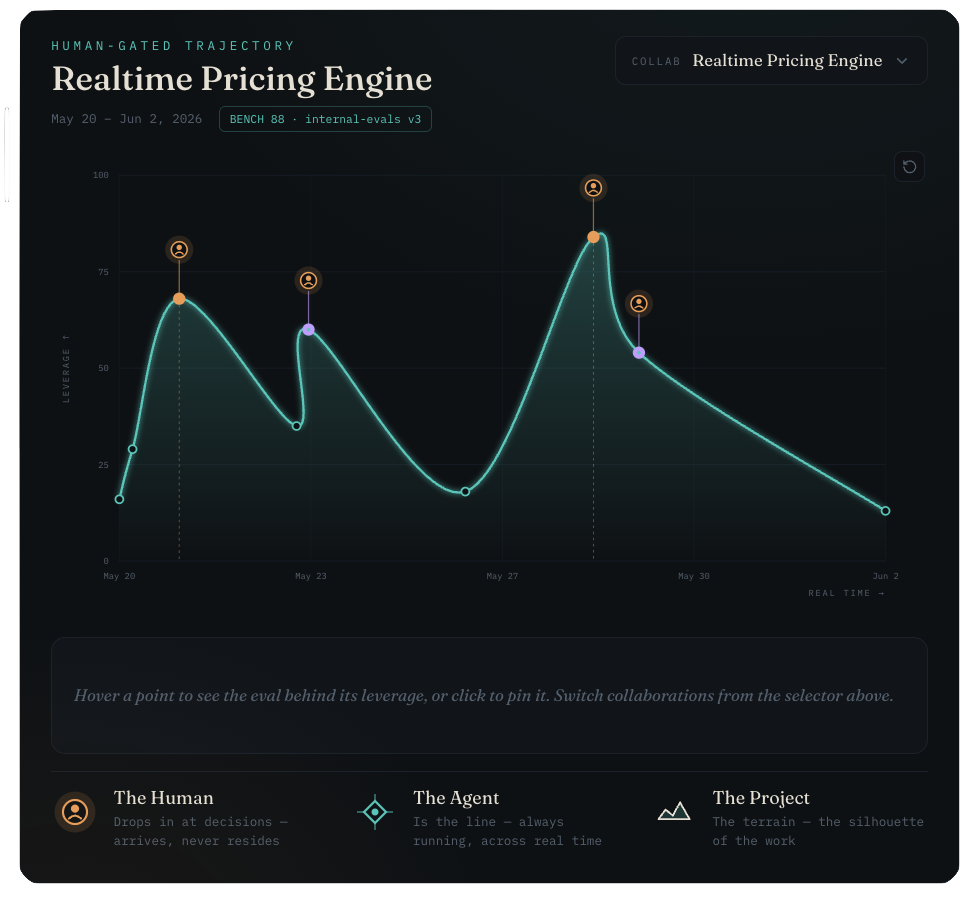

# Agent Judgement Map

**A visual grammar for deciding where human judgement belongs in agentic project work.**

> **Autonomy in the valleys. Humans at the summits.**

**[▶ Live demo](https://bparker2200.github.io/agent-judgement-map/)**

Agent Judgement Map plots a project as a line over time. The x-axis is **real time** (the work unfolding); the y-axis is **leverage** (how much a wrong call would cost). The line rises into **peaks** where human judgement matters most and sinks into **valleys** where an agent can safely keep moving on its own.

It's not an argument for constant oversight. It's an argument for **well-placed intervention** — a few human gates at the summits, autonomy everywhere else.

Today it's a **retrospective / audit** tool: you plot a finished project and read where human judgement actually mattered. (A prospective "predicted-vs-realized" mode is on the roadmap — see [DESIGN.md](DESIGN.md).)

It's implemented as a small React template (Vite + plain CSS) so you can fork it, drop in your own project's events, and see the shape of where judgement lived.

## Screenshot



## How to read the chart

- **The line is the agent** — always running, left to right, across real time.
- **The peaks are leverage** — moments where being wrong is expensive, far-reaching, hard to undo, or uncertain. Put a human here.
- **The valleys are autonomy** — low-stakes, reversible, high-confidence work. Let the agent run.
- **The glyphs** mark who's involved at each point:
  - **Human gate** — a human decision or approval (a summit).
  - **Collaboration** — human and agent working together.
  - **Agent autonomous** — the agent working alone (a valley).

Hover any point to see the four signals that produced its leverage. Click to pin it.

## Quick start

You'll need [Node.js](https://nodejs.org) 18+ installed.

```bash
# 1. install dependencies
npm install

# 2. run it locally (opens a dev server, usually http://localhost:5173)
npm run dev

# 3. build for production when you're ready to deploy
npm run build
```

## Editing your project data

**This is the one file you edit:** [`src/projectData.js`](src/projectData.js).

Each project is a list of events. Each event has a `type`, a `time`, a `title`, and five `scores`:

```js
{
  id: "pricing",
  name: "Realtime Pricing Engine",
  when: "May 20 – Jun 2, 2026",
  benchmark: { suite: "internal-evals v3", score: 88 },
  events: [
    {
      type: "gate",                  // "ai" | "gate" | "collab"
      time: "2026-05-21T10:00",      // real timestamp — drives the x-axis
      title: "Human picks the rate strategy",
      scores: {
        costOfError: 78,             // how expensive it is to be wrong
        blastRadius: 70,             // how widely a wrong call spreads
        reversibility: 30,           // how easily it's undone (high = lower leverage)
        detectability: 35,           // how quickly you'd notice (high = lower leverage)
        confidence: 60,              // the agent's calibrated confidence (high = lower leverage)
      },
    },
    // ...more events
  ],
}
```

Change the names, times, and scores — the leverage line redraws itself. For a clean starting point, copy the minimal template in [`examples/sample-projects.js`](examples/sample-projects.js).

## What the leverage score means

Leverage is **derived, not declared.** Each event's five scores are blended into one number (0–100) in [`src/scoring.js`](src/scoring.js). The blend is **expected-loss-shaped** — a product, not a sum:

> **leverage = severity × exposure**
> **severity** — how bad it is if wrong — rises with **cost of error** and **blast radius**, and falls as **reversibility** and **detectability** rise.
> **exposure** — how likely it is to be wrong — falls as **confidence** rises, but only so far.

In plain terms: high cost, wide blast radius, low reversibility, or low detectability all push a moment toward needing human judgement. Those are your summits. Because the signals multiply rather than average, a moment that's fully reversible or instantly detectable is a valley no matter how costly it looks, and a catastrophic signal can't be averaged away by three benign ones.

Two knobs in `scoring.js`:

- `SEVERITY_WEIGHTS` — how much each context signal counts toward severity.
- `CONFIDENCE_TRUST` — how much of the agent's confidence you bank. At the default `0.5`, confidence can cut leverage by at most half. Raise it toward `1.0` only if confidence comes from a calibrated eval rather than the agent's own report.

> **The default weights are illustrative, not validated** — they were tuned so the sample data tells a clean story. Don't cite them as if `0.35` means something. See [DESIGN.md](DESIGN.md) for the reasoning, including why `cost / blast / reversibility / detectability` are deployment-context facts (not eval outputs).

## Status & limitations

This is a **concept demo with illustrative scoring**, released so the idea can be used and built on — not a calibrated risk system. Three things to know before you trust a curve:

- **The weights are illustrative.** They shape the demo; they aren't derived from anything.
- **Self-reported confidence can hide the peak that matters.** An overconfident agent flattens its own summit — exactly where a human was needed. `CONFIDENCE_TRUST` caps how much it can flatten, but the fix is calibrated/external confidence, never raw self-report.
- **The cost of arrival isn't drawn yet.** A human gate blocks while you wait for the human; that latency is a real cost the line doesn't show.

The chart also can't show risk it was never given: **unlogged decisions are invisible** (a non-event is a blank, not a low point), and **slow-burn risk** (many trivial steps compounding) reads as a flat valley. Full design rationale, known failure modes, and roadmap live in [DESIGN.md](DESIGN.md).

## How to use this

1. Plot your project's meaningful events over time.
2. Score each event by consequence and uncertainty.
3. Look for the peaks.
4. Add human gates at the peaks.
5. Let agents move through the valleys.

## Customizing the style

The visual look (dark background, glowing line, glyphs) lives in two places:

- Page-level styling — background, fonts, animations — is in [`src/styles.css`](src/styles.css).
- The chart's color palette is the `C` object near the top of [`src/ProjectShape.jsx`](src/ProjectShape.jsx). Change those hex values to re-theme the graph.

## Project structure

```
agent_judgement_map/
  README.md            ← you are here (for humans)
  AGENTS.md            ← guidance for AI coding agents
  LICENSE
  package.json
  index.html
  vite.config.js
  src/
    main.jsx           entry point
    App.jsx            loads the data and renders the chart
    ProjectShape.jsx   the main visual component
    projectData.js     ← edit your project/event data here
    scoring.js         the leverage calculation
    styles.css         page-level styling
  examples/
    sample-projects.js a minimal copy-paste template
```

## Project status

**Provided as-is, and not actively maintained.** This is shared as a concept and a starting point, not a supported product — think of it as a seed, not a service. The most useful thing you can do with it is **fork it and make it yours.** The MIT license means you're free to use, change, and ship it however you like, no permission needed.

Issues and pull requests are welcome, but please don't expect a fast response — or any response. If something's broken or you've got a better idea, the fastest path is your own fork. If you build something good on top of this, it'd be lovely to see it.

If you do open a PR, please keep the core idea intact (_autonomy in the valleys, humans at the summits_), keep dependencies minimal, and make sure `npm run build` passes.

## License

MIT — see [LICENSE](LICENSE). Copyright (c) 2026 Brandon Parker.
